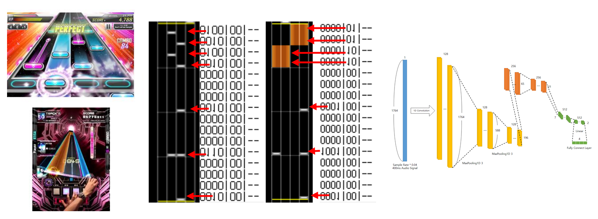

# voltexNet

Sound Voltex pattern make using deep learning
paper in IPIU2020, It will be updated soon.

In the test_output\test_kshfolder, there is a prediction of the trained model.

리듬게임의 채보가 언제 등장할지 딥러닝을 이용해 예측하는 프로젝트입니다.
게임은 사운드 볼텍스를 선택하여 학습용 데이터로는 SDVX I의 .ksh 파일들을 이용하였습니다.

모델의 예측능력이 어느정도는 따라가지만, val_Accuracy가 66~70%를 넘지 못하기에
후처리 또는 STFT를 적용하는 방향으로 모델을 전환할 예정(2월 이내)

